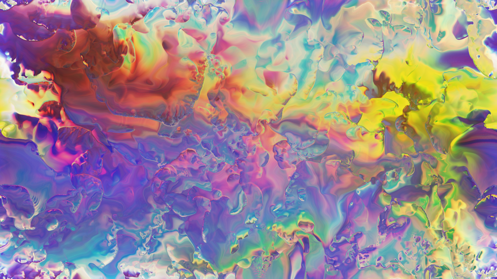

# Unity | Displacement with Dispersion Shader

The shader code is converted to use in Unity3D from"Displacement with Dispersion" created by cornusammonis on Shadertoy(https://www.shadertoy.com/view/4ldGDB)
If you are looking for shaders that do displacement, fluids, etc, this repo might be interesting.

Which texture applied to the material would definitely change the final image, feel free to explore this beautiful shader.

Video on YouTube(https://youtu.be/SktwRNF2M5k)